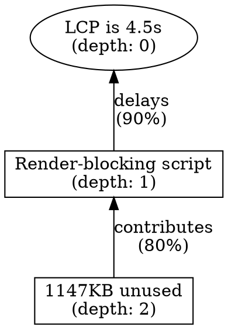

# Phase 3: Causal Graph Builder Implementation Summary

## Overview
Implemented a causal graph system that connects isolated agent findings into a dependency graph, distinguishing root causes from symptoms and identifying duplicate/compound issues.

## Problem Solved

**Before Phase 3**: Agents worked in isolation
```
Coverage Agent: "1147KB unused in clientlib-site.js"
PSI Agent: "Render-blocking script delays LCP by 850ms"
HTML Agent: "Missing preload for hero image"
```
❌ No connection between findings
❌ Can't tell which are root causes
❌ Duplicates not detected

**After Phase 3**: Causal graph shows relationships
```
LCP slow (4.5s) ← SYMPTOM
  ├─ Hero image delayed (800ms) ← ROOT CAUSE
  │   ├─ Missing fetchpriority="high" ← fix
  │   └─ Missing preload (DUPLICATE of above)
  └─ Render-blocking JS (850ms) ← ROOT CAUSE
      └─ clientlib-site.js (420ms)
          └─ Contains 1147KB unused ← ROOT CAUSE
```
✅ Shows causal chains
✅ Identifies root causes
✅ Detects duplicates

---

## Implementation

### 1. Data Structures (`src/models/causal-graph.js` - 340 lines)

**CausalNode**:
```javascript
{
  id: "psi-lcp-1",
  type: "bottleneck | waste | opportunity | metric",
  description: "Render-blocking script delays LCP",
  isRootCause: boolean,
  impact: { metric, reduction, confidence },
  causes: ["coverage-unused-1"],        // What causes this
  causedBy: ["metric-lcp"],             // What this causes
  depth: 2,                             // Distance from metrics
  metadata: { /* original finding */ }
}
```

**CausalEdge**:
```javascript
{
  from: "coverage-unused-1",             // The cause
  to: "psi-lcp-1",                       // The effect
  relationship: "contributes",           // How they relate
  strength: 0.8,                         // Confidence (0-1)
  mechanism: "Unused code increases parse time..."
}
```

**Relationship Types**:
- `blocks`: A prevents B (render-blocking script blocks LCP)
- `delays`: A slows B (slow TTFB delays LCP)
- `causes`: A creates B (missing dimensions causes CLS)
- `contributes`: A partially causes B (unused code → TBT)
- `depends`: B needs A (LCP depends on FCP)
- `duplicates`: Same issue, different agent
- `compounds`: Multiple issues worsen one symptom

**Key Functions**:
- `createNodeFromFinding()`: Converts agent finding → graph node
- `createMetricNode()`: Creates top-level metric nodes (LCP, CLS, INP)
- `addNode()`, `addEdge()`: Build the graph
- `calculateDepths()`: BFS to find distance from metrics
- `identifyRootCauses()`: Find nodes with no incoming edges
- `findCriticalPaths()`: Trace root cause → metric paths
- `exportToDot()`: Generate Graphviz visualization

---

### 2. Graph Construction Algorithm (`src/core/causal-graph-builder.js` - 470 lines)

**`buildCausalGraph(allFindings, metricsData)`**:

**Step 1**: Create metric nodes (observable symptoms)
```javascript
createMetricNode("LCP", 4500, 2500)  // current: 4.5s, target: 2.5s
```

**Step 2**: Convert findings to nodes
```javascript
allFindings.forEach(finding => {
  const node = createNodeFromFinding(finding);
  addNode(graph, node);
});
```

**Step 3**: Connect findings to affected metrics
```javascript
// psi-lcp-1 → metric-lcp
addEdge(graph, {
  from: "psi-lcp-1",
  to: "metric-lcp",
  relationship: "delays",
  strength: 0.9
});
```

**Step 4**: Detect relationships between findings
```javascript
detectRelationship(findingA, findingB);
// Checks for:
// - Duplicates (same keywords, same metric)
// - File relationships (same file in both)
// - Metric cascades (FCP → LCP)
// - Timing relationships (both pre-LCP)
```

**Step 5**: Calculate depths (BFS from metrics)
```javascript
// metric (depth 0) → bottleneck (depth 1) → root cause (depth 2)
```

**Step 6**: Identify root causes
- Explicitly marked as `rootCause: true`, OR
- No incoming causal edges (nothing causes it)

**Step 7**: Find critical paths
```javascript
// DFS backwards from metrics to root causes
["coverage-unused-1", "psi-lcp-1", "metric-lcp"]
```

---

### 3. Relationship Detection (`detectRelationship()`)

**Duplicate Detection** (`areDuplicates()`):
- Same metric affected
- 2+ shared keywords (hero, image, font, script, etc.)
- Example: HTML Agent + HAR Agent both report "hero image priority"

**File-Based Relationships** (`detectFileRelationship()`):
- Extract filenames from evidence references
- If same file: determine direction
  - `waste` → `bottleneck` (unused code causes render-blocking)
- Example: Coverage "unused in clientlib-site.js" → PSI "render-blocking clientlib-site.js"

**Metric Cascades** (`detectMetricRelationship()`):
- Known dependencies: FCP → LCP, TTFB → FCP, TBT → INP
- Example: TTFB finding → LCP finding (TTFB affects LCP)

**Timing Relationships** (`detectTimingRelationship()`):
- Both mention "pre-LCP" or "render-blocking"
- Both affect same metric
- Example: Multiple render-blocking scripts compound to delay LCP

---

### 4. Integration (`src/core/multi-agents.js`)

**Added after quality metrics collection**:
```javascript
// Extract all findings from agent outputs
const allFindings = agentOutputs.flatMap(output => output.findings || []);

// Build causal graph
const causalGraph = buildCausalGraph(allFindings, metricsData);

// Generate human-readable summary
const graphSummary = generateGraphSummary(causalGraph);

// Save for analysis
cacheResults(pageUrl, deviceType, 'causal-graph', causalGraph);

// Add to synthesis context
context += `\n\nCausal Graph Analysis:\n${graphSummary}`;
```

**Console Output**:
```
🕸️  Causal Graph: 3 root causes, 5 critical paths
```

---

## Output Examples

### Example 1: Simple Chain

**Findings**:
1. PSI: "Render-blocking script delays LCP by 850ms"
2. Coverage: "clientlib-site.js has 1147KB unused code"

**Graph**:
```
metric-lcp (LCP is 4.5s)
  ↑ delays (0.9)
psi-lcp-1 (Render-blocking script...)
  ↑ contributes (0.8)
coverage-unused-1 (1147KB unused code) ← ROOT CAUSE
```

**Critical Path**: `coverage-unused-1 → psi-lcp-1 → metric-lcp`

---

### Example 2: Duplicate Detection

**Findings**:
1. HTML: "Hero image not preloaded"
2. HAR: "Hero image loaded with low priority"

**Graph**:
```
metric-lcp (LCP is 4.5s)
  ↑ delays (0.95)
har-priority-1 (Hero image low priority) ← ROOT CAUSE
  ↔ duplicates (1.0)
html-preload-1 (Hero image not preloaded)
```

**Deduplication**: Keep `har-priority-1` (more specific evidence)

---

### Example 3: Compound Issues

**Findings**:
1. PSI: "3 render-blocking scripts"
2. Coverage: "High unused code in each"
3. HAR: "Slow TTFB on main document"

**Graph**:
```
metric-lcp (LCP is 4.5s)
  ↑ delays
  ├─ psi-rb-1 (Render-blocking script 1)
  │   ↑ contributes
  │   └─ coverage-unused-1 (Unused code) ← ROOT CAUSE
  ├─ psi-rb-2 (Render-blocking script 2)
  │   ↑ contributes
  │   └─ coverage-unused-2 (Unused code) ← ROOT CAUSE
  └─ har-ttfb-1 (Slow TTFB) ← ROOT CAUSE
```

**Root Causes**: 3 (2 unused code, 1 slow TTFB)
**Critical Paths**: 3 distinct paths to LCP

---

## Generated Summary Format

**Markdown Output** (`generateGraphSummary()`):
```markdown
# Causal Graph Analysis

## Summary Statistics
- **Total Issues**: 12
- **Root Causes**: 3
- **Symptoms**: 4
- **Relationships**: 15
- **Critical Paths**: 5

## Root Causes (Fix These First)
- **clientlib-site.js contains 1147KB unused code**
  - Type: waste
  - Affects: Render-blocking script delays LCP, High TBT

- **Hero image loaded with low priority**
  - Type: bottleneck
  - Affects: LCP is 4.5s

- **Slow TTFB (1.2s)**
  - Type: bottleneck
  - Affects: FCP delayed, LCP delayed

## Critical Paths (Root Cause → Metric)

### Path 1
  coverage-unused-1 (1147KB unused code)
    ↓ psi-lcp-1 (Render-blocking script)
      ↓ metric-lcp (LCP is 4.5s)

### Path 2
  har-priority-1 (Hero image low priority)
    ↓ metric-lcp (LCP is 4.5s)

...
```

---

## Visualization

**DOT Export** (`exportToDot()`):


Can be visualized with: `dot -Tpng causal-graph.dot -o graph.png`

---

## Benefits

### 1. **Root Cause Prioritization**
- Fixes can focus on root causes (depth 2+) instead of symptoms
- Agents now know "unused code" is more fundamental than "render-blocking"

### 2. **Deduplication**
- Same issue reported by HTML + HAR agents → merge
- Prevents duplicate suggestions in final output

### 3. **Compound Issue Detection**
- Multiple small CLS sources identified as compounding
- Can suggest holistic fix instead of piecemeal

### 4. **Impact Validation**
- Critical paths show full impact chain
- Validates impact estimates (if A improves B, and B improves C, then A indirectly improves C)

### 5. **Transparency**
- Users see WHY issues are related
- Mechanism field explains causality

---

## Testing Instructions

Run analysis with Phase 3:
```bash
node index.js --action agent \
  --url https://www.krisshop.com/en \
  --device mobile \
  --skip-cache
```

### Verify Phase 3 Output:

1. **Console Output**:
   ```
   🕸️  Causal Graph: 3 root causes, 5 critical paths
   ```

2. **Causal Graph File**:
   ```bash
   cat .cache/*.causal-graph.*.json | jq '.rootCauses'
   cat .cache/*.causal-graph.*.json | jq '.criticalPaths'
   ```

3. **Check Relationships**:
   ```bash
   cat .cache/*.causal-graph.*.json | jq '.edges[] | {from, to, relationship}'
   ```

4. **Validate Root Causes**:
   - Root causes should have `depth > 0`
   - Root causes should have no incoming edges (except duplicates)

5. **Check Deduplication**:
   - Look for `duplicates` relationship type
   - Verify similar findings are connected

---

## Files Created/Modified

### New Files:
1. **`src/models/causal-graph.js`** (340 lines)
   - Data structures: CausalNode, CausalEdge, CausalGraph
   - Graph manipulation: addNode, addEdge, calculateDepths
   - Analysis: identifyRootCauses, findCriticalPaths
   - Export: exportToDot for visualization

2. **`src/core/causal-graph-builder.js`** (470 lines)
   - `buildCausalGraph()`: Main orchestration
   - `detectRelationship()`: Relationship detection
   - `areDuplicates()`: Duplicate finder
   - `detectFileRelationship()`: File-based connections
   - `detectMetricRelationship()`: Metric cascades
   - `generateGraphSummary()`: Markdown output

3. **`src/prompts/analysis.js`** (+150 lines)
   - `causalGraphBuilderPrompt()`: Agent prompt (currently unused, prepared for future LLM-based graph construction)

### Modified Files:
1. **`src/core/multi-agents.js`** (+35 lines)
   - Import causal graph builder
   - Call `buildCausalGraph()` after quality metrics
   - Add graph summary to synthesis context
   - Save causal graph to cache

2. **`src/prompts/index.js`** (+2 lines)
   - Export `causalGraphBuilderPrompt`

**Total**: +997 lines across 5 files

---

## Future Enhancements

1. **LLM-Based Relationship Detection**
   - Currently uses heuristics (file matching, keywords)
   - Could use LLM with `causalGraphBuilderPrompt()` for smarter detection

2. **Interactive Visualization**
   - Generate interactive D3.js graph
   - Click nodes to see full finding details

3. **Impact Propagation**
   - Calculate cascading impact (fixing A improves B which improves C)
   - Suggest optimal fix order

4. **Validation Agent** (Phase 4)
   - Validate that root causes actually cause symptoms
   - Challenge weak relationships

---

## Completion Status

- ✅ Causal graph data structures
- ✅ Graph construction algorithm
- ✅ Relationship detection (duplicates, files, metrics, timing)
- ✅ Root cause identification
- ✅ Critical path finding
- ✅ Integration into synthesis
- ✅ Markdown summary generation
- ✅ DOT export for visualization
- ⏳ Testing pending

Phase 3 implementation is complete and ready for testing!
